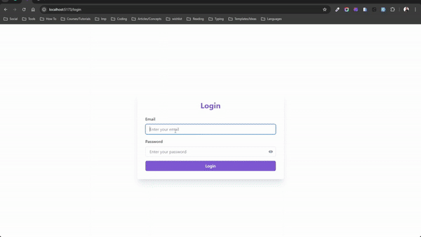
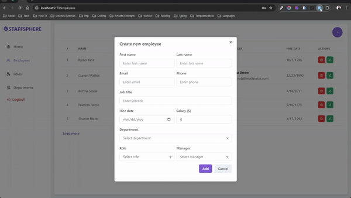

# StaffSphere

> StaffSphere is an Employee Management System that allows you to manage your employees, departments, and roles. You can view, add, update, and delete employees, departments, and roles. You can also view simple statistics, and update an employee's manager.

## Author

[Asmaa Hamid](https://linktr.ee/asmaahamid02)

## Requirements

- Node.js
- PostgreSQL
- Docker (optional)
- PostgreSQL Client (optional)

## Technologies Used

- TypeScript
- Node.js
- Express.js
- PostgreSQL
- React.js
- Chakra UI
- Formik & Yup
- Axios
- TanStack Query

## Demo




## Installation

1. Clone the repository

   ```bash
   git clone
   ```

2. Copy .env.example in each of the client and server directories and rename it to .env

   ```bash
   cp .env.example .env
   ```

3. Change the environment variables in the .env files to match your configurations

4. Install PostgresSQL

   - Using Docker

     ```bash
     cd packages/server
        docker-compose up -d
     ```

   - Without Docker (Local Installation)

     - Install PostgreSQL [here](https://www.postgresql.org/download/)
     - Create a database
     - Update the DATABASE_URL in the .env file

5. Install dependencies (root directory)

   ```bash
   npm install
   ```

6. Generate the database schema and Prisma client

   ```bash
   cd packages/server
   npm run migrate
   ```

7. Seed the database

   ```bash
   cd packages/server
   npm run seed
   ```

8. Start the server

   ```bash
   cd packages/server
   npm run dev
   ```

9. Start the client

   ```bash
   cd packages/client
   npm run dev
   ```

## Credentials

```json
{
  "email": "admin@example.com",
  "password": "Admin123!"
}
```
